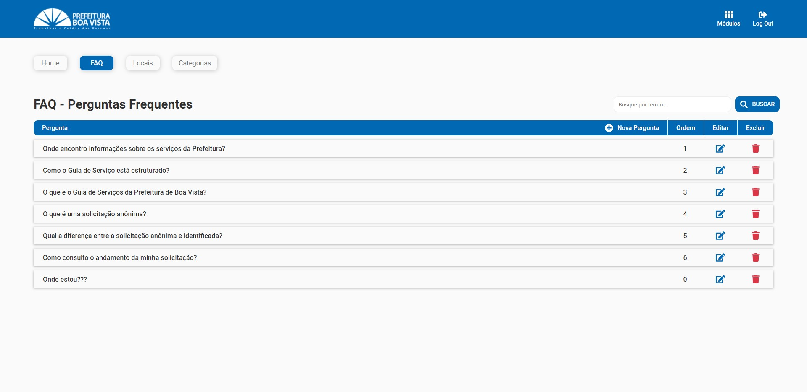

 <h3 align="center">Desafio front-end</h3>

<br />

<div align="center">
  <a href="https://www.linkedin.com/in/higordenomar/">
    
  </a>

  <a href="mailto:higordenomar@hotmail.com">
    
  </a>
  <br><br>
</div>

Projeto construído utilizando [React.js](https://pt-br.reactjs.org/) e [Styled Components](https://styled-components.com/docs/basics).

</br>

> Saiba mais sobre o desafio [clicando aqui.](./.github/README.md)

<br/>

## 📷 Screenshots



<br/><br/>

## 💻 Instalação


```sh
# Clone este repositório (requer o git instalado):

> git clone https://github.com/HigorDenomar/teste-front-metasix.git


# Vá para o diretório do projeto:

> cd teste-front-metasix


# Instale as dependência (requer o node.js instalado):

> npm install


# inicie o projeto:

> npm start
```

O site irá abrir em http://localhost:3000

### Configurando variáveis de ambiente
Para as requisições a api funcionarem corretamente é necessário criar um arquivo ``.env`` na raiz do projeto e setar as seguintes variáveis:
```sh
REACT_APP_API_URL
```

```
REACT_APP_HEADER_AUTHORIZATION
```
(Veja um exemplo de utilização das variáveis de ambiente no arquivo ``example.env``)

</br></br>
<i>Code By [Higor Denomar](https://github.com/HigorDenomar)</i>